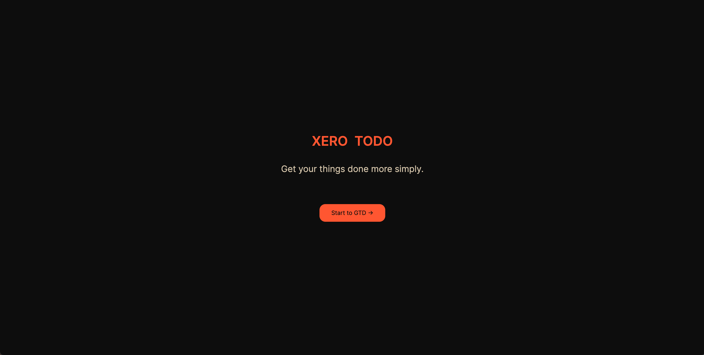
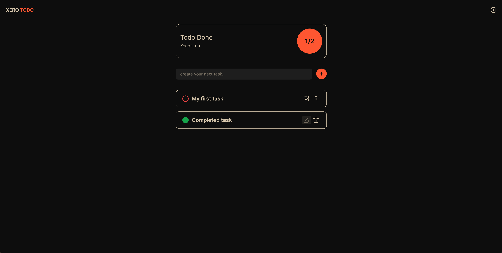

# TODO List App Challenge
This is a [Next.js](https://nextjs.org/) project bootstrapped with [`create-next-app`](https://github.com/vercel/next.js/tree/canary/packages/create-next-app).

## Run App

First, create `.env` file base on `.env.example`:

```bash
npm run dev
# or
yarn dev
# or
pnpm dev
# or
bun dev
```
Open http://localhost:3000 with your browser to see the result.

## Features
- Login/Sign-up
- Create Task
- Edit Task
- Delete Task
- Mark as Completed

## Stacks
- Frontend -> [Next.js](https://nextjs.org/)
- Auth -> [Supabase](https://supabase.com/)
- Database -> [Supabase](https://supabase.com/)
- UI -> [TailwindCSS](https://tailwindcss.com/) + [Radix UI](https://www.radix-ui.com/)
- State Management -> [Zustand](https://github.com/pmndrs/zustand)

## Screenshots
### Home page


### Sign in page


### Default View


### TBD


### Completed


### Update Task 


### Updated Task

